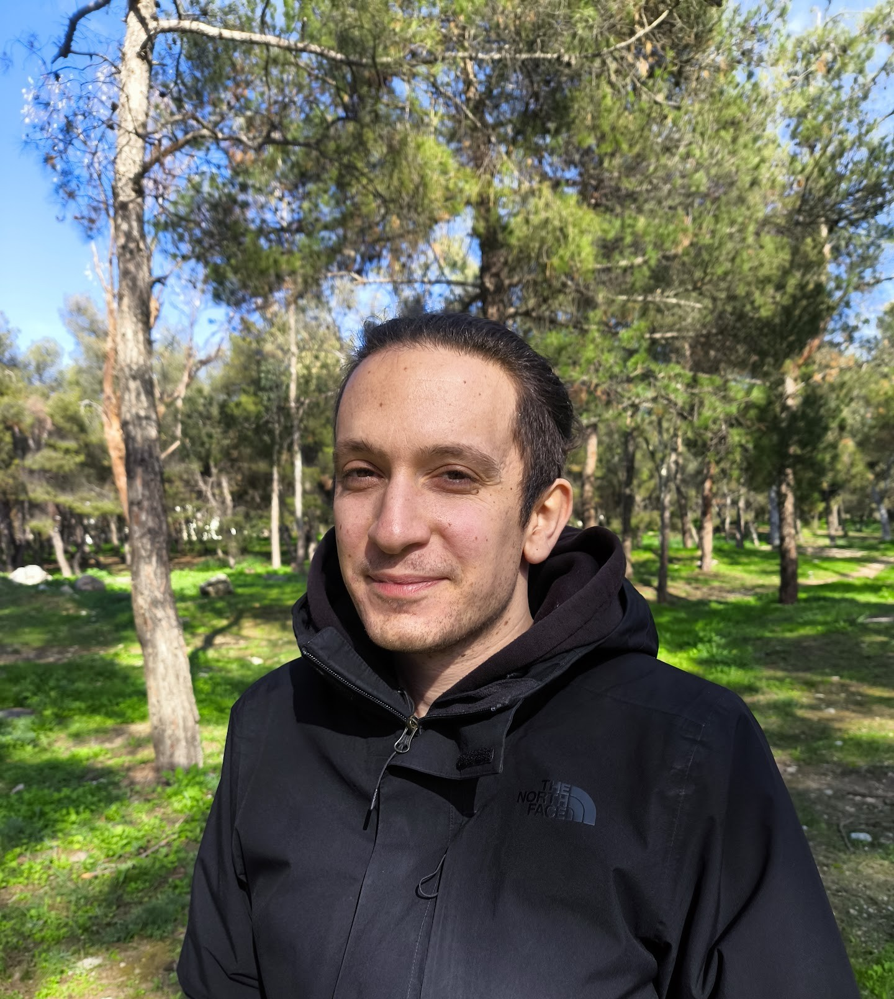

{% include figure.html img="colorai.png" alt="colorai logo" width="60%" %}

Many of the recent advancements in AI are due to exploiting <i><b>structured low-rank representations</b></i>, from  low-rank tensor factorizations <cite>(Kolda and Bader 2009; Kossaifi et al. 2019)</cite> for scaling large language models (LLMs), e.g., via adapters <cite>(Hu et al. 2021)</cite> or structured matrices
<cite>(Dao et al. 2022)</cite>; the diffusion of compact polynomial representations as powerful inductive biases for deep learning architectures <cite>(Cheng et al. 2024)</cite>; the emergence of probabilistic circuits to provide tractable probabilistic inference with guarantees <cite>(Loconte et al. 2024; Choi et al. 2020)</cite> and reliable neuro-symbolic AI <cite>(Ahmed et al. 2022)</cite>; and the wide application of tensor networks to solve and accelerate physics-related problems <cite>(Biamonte and Bergholm 2017)</cite> and quantum computing <cite>(Orus 2019)</cite>. 

### *"How are all these representations related to each others? and how can we transfer knowledge across communities?"*

We will try to answer the above questions in our day workshop at [the Thirty-Ninth AAAI Conference on Artificial Intelligence](https://aaai.org/conference/aaai/aaai-25/) (**AAAI-25**). The workshop will be held at the Pennsylvania Convention Center in Philadelphia, Pennsylvania, USA, March 4, 2025.

See our [call for papers](https://april-tools.github.io/colorai/cfp.html).

✨ Check out also the Tutorial on <a href="https://april-tools.github.io/aaai25-tf-pc-tutorial/"><b>tensor factorizations and probabilistic circuits</b></a> also at AAAI-25! ✨

# News
- **[25th Feb 2024]** [Schedule](https://april-tools.github.io/colorai/schedule.html) is up!
- **[27th Jan 2024]** Unfortunately, Yannis Panagakis won't be able to give a talk, but we are happy to welcome his student Alexandros Georgiou!
- **[9th Dec 2024]** 21 papers [accepted](https://april-tools.github.io/colorai/accepted.html) at the workshop, see you in Philadelphia!
- **[15th Oct 2024]** Nadav, Guillame, Yannis and Andrew confirmed to be [speakers](https://april-tools.github.io/colorai/index#speakers)!
- **[25th Sep 2024]** [Openreview](https://openreview.net/group?id=AAAI.org/2025/Workshop/CoLoRAI) is open to receive submissions! 
- **[20th Sep 2024]** Website is on! 

# Speakers

    

         
        

        <b><a href="https://www.cohennadav.com/">Nadav Cohen</a></b>

        

        <i> Tel Aviv University</i>
        

    

    

         
        

        <b><a href="https://www-labs.iro.umontreal.ca/~grabus/">Guillaume Rabusseau</a></b>

        

        <i>UdeM/MILA</i>
        

    

    

         
        

        <b><a href="http://users.uoa.gr/~yannisp/">Alexandros Georgiou</a></b>

        

        <i>University of Athens</i>
        

    

    

        
        

        <b><a href="https://cims.nyu.edu/~andrewgw/">Andrew Wilson</a></b>

        

        <i>NYU</i>
        

    

# Organizers

    

         
        

        <b><a href="https://april-tools.github.io/">Antonio Vergari</a></b>

        

        <i>University of Edinburgh</i>
        

    

    

         
        

        <b><a href="https://grigoris.ece.wisc.edu/">Grigorios Chrysos</a></b>

        

        <i>UW Madison</i>
        

    

    

         
        

        <b><a href="https://scholar.google.com/citations?user=i4JrumAAAAAJ">Chao Li</a></b>

        

        <i>RIKEN-AIP</i>
        

    

    

        
        

        <b><a href="https://www.math.ucla.edu/~deanna/">Deanna Needell</a></b>

        

        <i>UCLA</i>
        

    

# Recommended reading

- Kolda and Bader 2009 - [Tensor decompositions and applications](https://www.kolda.net/publication/TensorReview.pdf)
- Hu et al. 2021 - [LoRA: Low-Rank Adaptation of Large Language Models](https://openreview.net/forum?id=nZeVKeeFYf9)
- Loconte et al. 2024 - [What is the Relationship between Tensor Factorizations and Circuits (and How Can We Exploit it)?](https://arxiv.org/abs/2409.07953v1)
- Dao et al. 2022 - [Monarch: Expressive Structured Matrices for Efficient and Accurate Training](https://proceedings.mlr.press/v162/dao22a/dao22a.pdf)
- Kossaifi et al. 2019 - [Tensorly: Tensor learning in python](https://www.jmlr.org/papers/v20/18-277.html)
- Cheng et al. 2024 - [Multilinear Operator Networks](https://openreview.net/forum?id=bbCL5aRjUx)
- Choi et al. 2020 - [Probabilistic Circuits: A Unifying Framework for Tractable Probabilistic Models](https://yoojungchoi.github.io/files/ProbCirc20.pdf)
- Ahmed et al. 2022 - [Semantic Probabilistic Layers for Neuro-Symbolic Learning](https://proceedings.neurips.cc/paper_files/paper/2022/hash/c182ec594f38926b7fcb827635b9a8f4-Abstract-Conference.html)
- Biamonte and Bergholm 2017 - [Tensor Networks in a Nutshell](https://arxiv.org/abs/1708.00006)
- Orus 2019 - [Tensor networks for complex quantum systems](https://www.nature.com/articles/s42254-019-0086-7)

> Last build date: {{ site.time | date: "%Y-%m-%d" }}.
